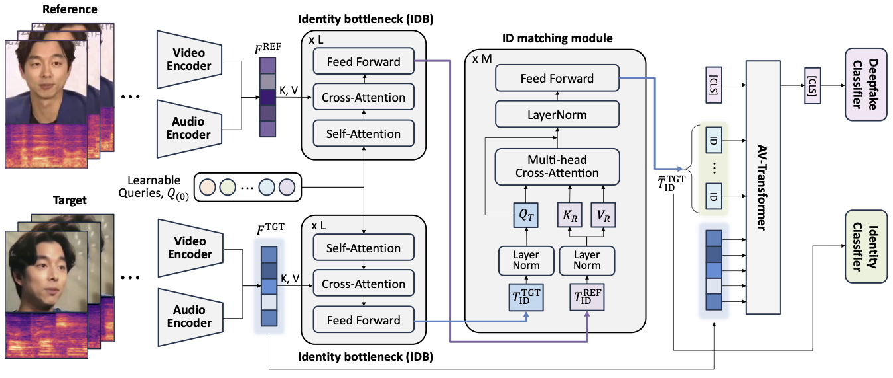

# Referee: Reference-aware Audiovisual Deepfake Detection
Hyemin Boo<sup>\*</sup>, Eunsang Lee<sup>\*</sup>, Jiyoung Lee<sup>†</sup>

<sup>\*</sup>Equal contribution
<sup>†</sup>Corresponding author

<div>
	<a href="https://arxiv.org/abs/2510.27475"></a>
</div>


## Abstract



Since deepfakes generated by advanced generative models have rapidly posed serious threats, existing audiovisual deepfake detection approaches struggle to generalize to unseen forgeries.
We propose a novel reference-aware audiovisual deepfake detection method, called ***Referee***.
Speaker-specific cues from only one-shot examples are leveraged to detect manipulations beyond spatiotemporal artifacts.
By matching and aligning identity-related queries from reference and target content into cross-modal features, ***Referee*** jointly reasons about audiovisual synchrony and identity consistency.
Extensive experiments on FakeAVCeleb, FaceForensics++, and KoDF demonstrate that ***Referee*** achieves state-of-the-art performance on cross-dataset and cross-language evaluation protocols.
Experimental results highlight the importance of cross-modal identity verification for future deepfake detection. 

## Requirements
### Environment
To train or evaluate Referee, you must first set up the environment:

```bash
conda create -n referee python=3.8.16
conda activate referee
pip install -r requirements.txt
```

### Dataset
For training and evaluation, the dataset should be prepared following the specified format.  
An example dataset structure is provided in the [`data/`](./data).

You can download the datasets from the following sources:

- [FakeAVCeleb](https://sites.google.com/view/fakeavcelebdash-lab/download)
- [FaceForensics++](https://docs.google.com/forms/d/e/1FAIpQLSdRRR3L5zAv6tQ_CKxmK4W96tAab_pfBu2EKAgQbeDVhmXagg/viewform)
- [KoDF](https://deepbrainai-research.github.io/kodf/)

All datasets should be sampled at 25 fps for video and 16 kHz for audio.
For FaceForensics++ and KoDF, faces need to be cropped at 1.3× the face size and resized to 224×224.

### Pretrained Checkpoints

This project requires pretrained checkpoints to run training, evaluation, or fine-tuning.

<!-- - **Training from Scratch**  
  To train the model from scratch, download the Synchformer checkpoint trained on **LRS3** from the [link](https://github.com/v-iashin/Synchformer) and place it in the `model/pretrained/` directory. -->

- **Training Referee from scratch** 

  To train ***Referee*** from scratch, you need a pretrained Synchformer backbone.
  Download the Synchformer checkpoint trained on **LRS3** from the [link](https://github.com/v-iashin/Synchformer) and place it in the `model/pretrained/` directory.

- **Evaluation or Fine-tuning Referee**  
  To evaluate or fine-tune ***Referee***, download the provided checkpoint from the [link](https://huggingface.co/eunsanglee/Referee/tree/main)  and put it into the `model/pretrained/` directory.

<!-- - **Training with Pretrained Synchformer**
  To train the model starting from a Synchformer backbone, download the checkpoint trained on LRS3 from the [link](https://github.com/v-iashin/Synchformer) and place it in the `model/pretrained/` directory. -->


## Train
To train ***Referee***, you can use the provided `train.sh`. Some training-specific settings, such as the number of epochs, starting epoch, and training dataset, are set directly in `train.sh`.

You can change most training parameters in the config file, `configs/pair_sync.yaml`. For example, you can adjust the learning rate, batch size, number of layers, etc.

Once you have set all parameters as desired, you can start training ***Referee*** using:

```bash
sh scripts/train.sh
```

## Evaluation
To evaluate ***Referee***, you can use the provided `test.sh`. Some evaluation-specific settings, such as the model path and test dataset, are set directly in `test.sh`.

You can change most evaluation parameters in the config file, `configs/pair_sync.yaml`. For example, you can adjust the number of layers, the number of identity queries, etc.

Once you have set all parameters as desired, you can start evaluating ***Referee*** using:

```bash
sh scripts/test.sh
```

## Citation

If you find our work helpful or inspiring, please feel free to cite it:

```bibtex
@article{boo2025referee,
  title={Referee: Reference-aware Audiovisual Deepfake Detection},
  author={Boo, Hyemin and Lee, Eunsang and Lee, Jiyoung},
  journal={arXiv preprint arXiv:2510.27475},
  year={2025}
}
```

## Acknowledgement
This project heavily references the implementation of [Synchformer](https://github.com/v-iashin/Synchformer).

We thank the authors for making their code publicly available.
